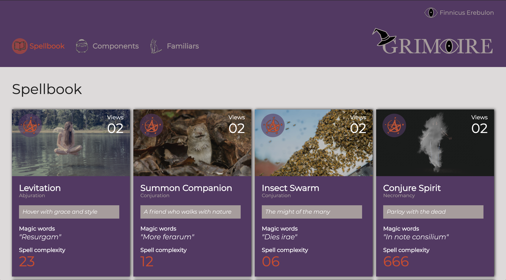
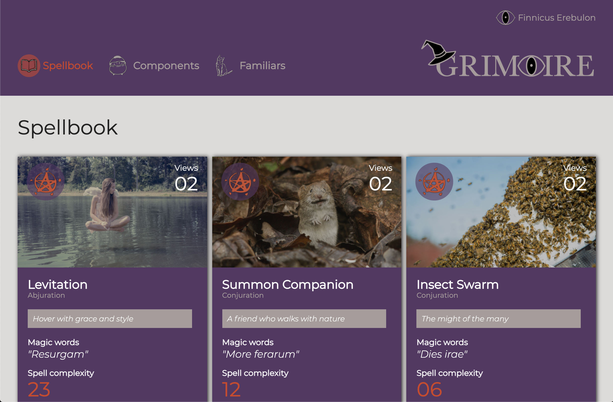
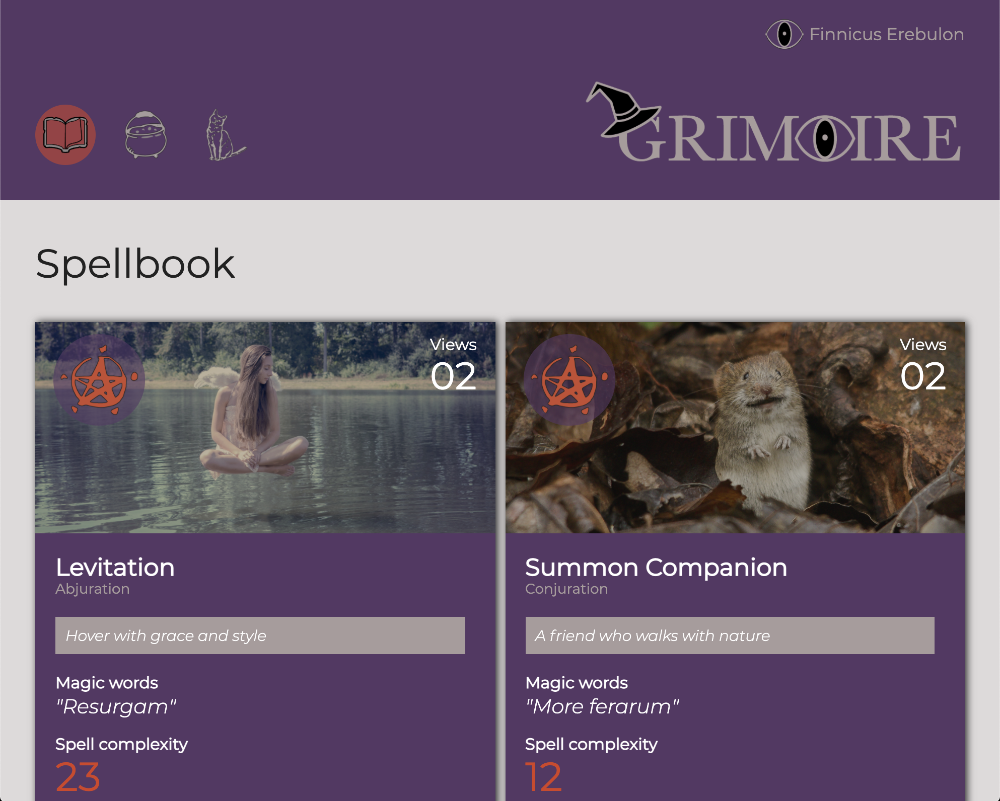
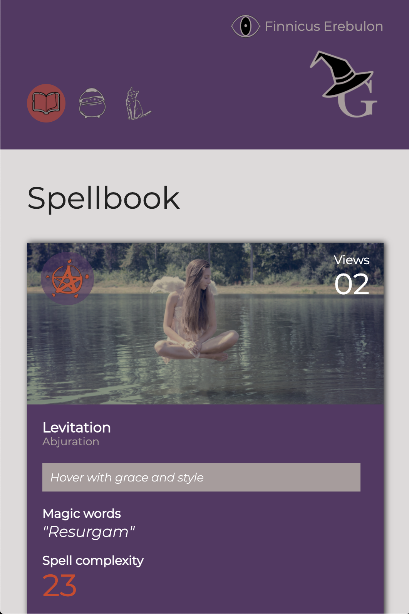

# Grimoire - a static comp  
Grimoire is a static comp representing a website where magic users can share their favorite spells. The assignment was to match the basic layout of a website comp but with the ability for creative license regarding the colors, content, images and icons. It was excellent to have the creative freedom that allowed me to use my tangential front-end skills of layout and graphic design. 

### Original Comp  

### Grimoire Site

## Responsive Design  
One key feature of the assignment was to ensure the site was responsive on multiple platforms, including mobile and desktop. In addition to altering CSS rules via media queries, the site has two logos to accommodate larger icons in the mobile views.  

## Tech
This comp uses both flex and grid but makes specific use of grid to overlay images on top of each other, something that was been previously challenging.

## Images
All images are from unsplash.com.
* Mist Form - De'Andre Bush
* Primastic Spray - Anton Darius
* Levitation - Piotr Wilk
* Call Lightning - Felix Mittermeier
* Insect Swarm - Edgar Chaparro
* Summon Companion - Giuseppe Martini
* Mirror Image - Grace Madeline
* Conjure Spirit - Josh Marshall
